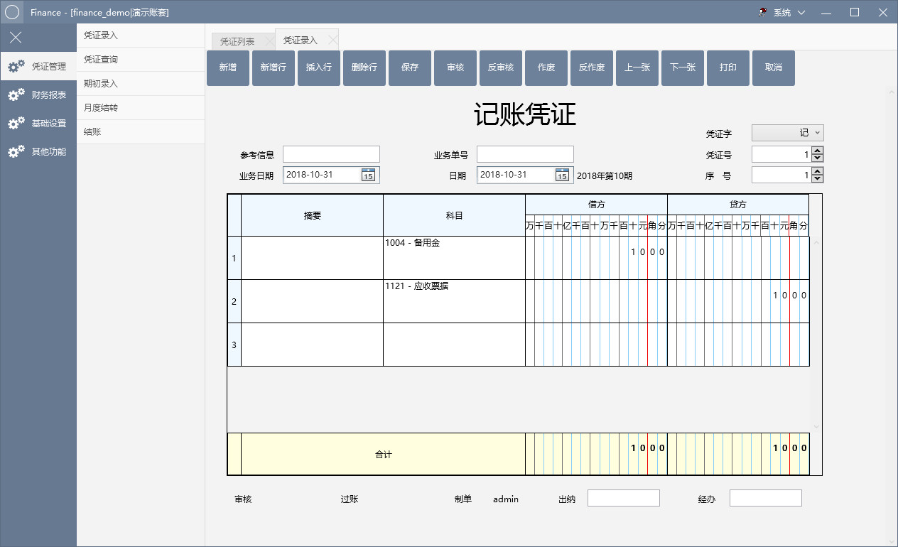

# finance

#### 项目介绍
一个简单的财务会计软件，能够录入会计凭证，并根据凭证自动生成三大报表。详情查看：https://www.cnblogs.com/edwardorchis/p/10506391.html

#### 如何快速开始
[https://www.cnblogs.com/edwardorchis/p/14405910.html](https://www.cnblogs.com/edwardorchis/p/14405910.html)

#### 软件架构
WPF的客户端+自宿主.Net Web API

#### 软件截图

#### 我们在凭证录入的时候可以使用这些快捷键增加效率：

| 单元格 | 快捷键 | 功能                       |
| ------ | ------ | -------------------------- |
| 摘要   | F7     | 弹出摘要选择框             |
| 科目   | F7     | 弹出科目选择框             |
| 科目   | F8     | 弹出扩展字段编辑界面             |
| 金额   | Esc/小键盘-    | 清空                       |
| 金额   | =      | 自动填充金额使凭证借贷平衡 |

#### 我们可以使用API文档自动生成凭证：[https://www.cnblogs.com/edwardorchis/p/10520389.html](https://www.cnblogs.com/edwardorchis/p/10520389.html)

#### 关于报表的公式说明：[https://www.cnblogs.com/edwardorchis/p/10744548.html](https://www.cnblogs.com/edwardorchis/p/10744548.html)

#### 我们可以通过适配存储过程自定义报表：[https://www.cnblogs.com/edwardorchis/p/10765979.html](https://www.cnblogs.com/edwardorchis/p/10765979.html)

#### 我们可以通过适配存储过程引入业务系统凭证：[https://www.cnblogs.com/edwardorchis/p/10765967.html](https://www.cnblogs.com/edwardorchis/p/10765967.html)
### 升级2.0.1.5版本说明
- 支持报表公式导入导出

### 升级2.0.1.1版本说明
- 支持Excel模板打印 [https://www.cnblogs.com/edwardorchis/p/11870128.html](https://www.cnblogs.com/edwardorchis/p/11870128.html)

### 升级2.0.0.9版本说明
- 支持辅助核算和数量核算 [https://www.cnblogs.com/edwardorchis/p/11802607.html](https://www.cnblogs.com/edwardorchis/p/11802607.html)

### 升级2.0.0.7版本说明
- 新增账套管理的控制窗体 [https://www.cnblogs.com/edwardorchis/p/10798613.html](https://www.cnblogs.com/edwardorchis/p/10798613.html)

### 升级2.0.0.6版本说明
- 支持月度结转 [https://www.cnblogs.com/edwardorchis/p/10854072.html](https://www.cnblogs.com/edwardorchis/p/10854072.html)
- 修复一些已知的BUG
- _需要在原有账套执行升级脚本2006_upgrade_01.sql_

### 升级2.0.0.5版本说明
- 支持多账套 [https://www.cnblogs.com/edwardorchis/p/10798613.html](https://www.cnblogs.com/edwardorchis/p/10798613.html)
- 支持按模块进行权限控制 [https://www.cnblogs.com/edwardorchis/p/10798811.html](https://www.cnblogs.com/edwardorchis/p/10798811.html)
- 凭证录入界面加入业务单号，根据业务单据自动生成凭证
- 科目关联扩展信息中增加金额反算单价数量
- 修复一些已知的BUG
- _需要在原有账套执行升级脚本2005_upgrade_01.sql_

### 升级2.0.0.4版本说明
- 支持存储过程引入凭证
- _需要在数据库执行升级脚本2004_upgrade_01.sql_

### 升级2.0.0.3版本说明
- 菜单支持自定编辑
- 自定义模板支持界面设置
- 支持自定义报表
- _需要在数据库执行升级脚本2003_upgrade_01.sql_

### 升级2.0.0.1版本说明

#### 本次更新主要有以下几个点增强
- 增加辅助资料管理界面
- 科目中增加标签，用以在凭证中扩展字段，详情可以查看 [https://www.cnblogs.com/edwardorchis/p/10633727.html](https://www.cnblogs.com/edwardorchis/p/10633727.html)
- 凭证中摘要可以预设，选择填入
- 凭证录入的回车焦点事件的优化
- 科目新增全称字段
- 增加凭证录入校验提示

### 升级2.0版本说明

- 在数据库执行脚本：2000_upgrade_01.sql
- 替换服务端和客户端所有组件，请注意不要把配置文件覆盖了
- 本次主要增加了凭证自定义面板，可以在表中_UdefTemplate自定义字段，注意要在_VoucherEntryUdef表中新增对应的字段

